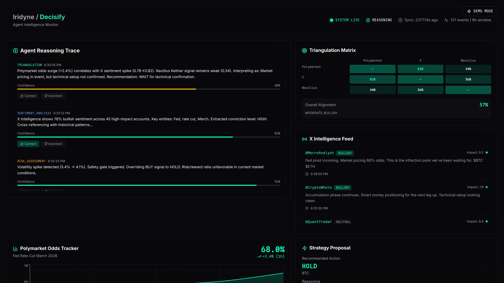

# Decisify 🎯

[](https://iridite.github.io/decisify/)
[](https://github.com/iridite/decisify/actions)
[](LICENSE)
[](https://www.python.org)
[](https://www.rust-lang.org)
[](https://github.com/iridite/decisify)

<div align="center">
  

  ### AI-powered decision intelligence platform with multi-source data integration

  [🚀 **Live Demo**](https://iridite.github.io/decisify/) | [📖 Documentation](docs/) | [🎬 Demo Video](docs/DEMO_VIDEO_SCRIPT.md) | [⚡ Quick Start](#-quick-start)
</div>

**[English](README.md)** | **[中文](README.zh.md)**

## 🏆 Hackathon Track 2 Alignment

> **Challenge:** *"How to design agent workflows and execution processes beyond just conversation? How can data, perception, execution, and incentives work together to enable agents to truly create value?"*

**Decisify's Answer:**

<table>
<tr>
<td width="50%">

### 🎯 The Problem
Current AI agents are stuck in **conversation mode**:
- ❌ Passive: Wait for user input
- ❌ Single-source: Limited context
- ❌ Black-box: Opaque reasoning
- ❌ Unsafe: No execution guardrails

</td>
<td width="50%">

### ✅ Our Solution
Decisify is a **true autonomous agent**:
- ✅ **Autonomous**: 5-second decision loops
- ✅ **Multi-source**: Twitter + Polymarket + News fusion
- ✅ **Transparent**: Full attention weight visualization
- ✅ **Safe**: Deterministic rules + human approval

</td>
</tr>
</table>

**This is not a chatbot. This is a decision-making intelligence system.**

### Why Decisify Wins Track 2

| Requirement | Traditional Agents | Decisify |
|-------------|-------------------|----------|
| **Beyond Chat** | Reactive Q&A | ✅ Autonomous 5s decision cycle |
| **Data Perception** | Single LLM knowledge | ✅ Real-time multi-source fusion |
| **Execution Safety** | Prompt engineering | ✅ Deterministic guardrails + human-in-loop |
| **Transparency** | Black box | ✅ Complete reasoning traces + attention weights |
| **Performance** | Pure Python | ✅ Rust-accelerated (1.4x faster) |
| **Scalability** | Hardcoded logic | ✅ Plugin-based sensor architecture |

## 📖 Project Overview

Decisify is a high-performance, logic-transparent AI decision engine that implements autonomous decision loops through multi-source signal fusion (social media, market data, news). The system uses a Python + Rust hybrid architecture to provide a complete perception → reasoning → execution workflow, with a real-time monitoring dashboard for human-agent collaboration.

**Core Features:**
- 🧠 **Transparent Reasoning**: Every decision includes complete reasoning traces and attention weights
- ⚡ **High Performance**: Rust-accelerated batch processing with 1.2-1.4x performance improvement
- 🛡️ **Safety First**: Deterministic guardrails prevent unsafe operations
- 🔄 **Autonomous Loop**: 5-second decision cycles without human intervention
- 📊 **Real-time Monitoring**: High-density dashboard displaying agent intelligence state
- 🌐 **Multi-source Fusion**: Softmax-based attention mechanism integrating heterogeneous signals

**Use Cases:**
- Quantitative trading decisions
- Risk management systems
- Intelligent advisory platforms
- Market intelligence analysis

## 💡 Innovation Highlights: Why Decisify Stands Out

### 🆚 Decisify vs Traditional AI Agents

| Feature | Traditional AI Agents | Decisify |
|---------|----------------------|----------|
| **Decision Mode** | 🔴 Passive: Wait for user questions | ✅ **Autonomous: 5-second self-driven loops** |
| **Data Sources** | 🔴 Single LLM knowledge base | ✅ **Multi-source fusion: Twitter + Polymarket + News** |
| **Reasoning** | 🔴 Black-box: Hidden logic | ✅ **Transparent: Full attention weights visualization** |
| **Safety** | 🔴 Prompt engineering (bypassable) | ✅ **Deterministic guardrails + human approval** |
| **Performance** | 🔴 Pure Python (~2-5ms) | ✅ **Rust-accelerated (<1ms, 1.4x faster)** |
| **Scalability** | 🔴 Hardcoded logic | ✅ **Plugin-based sensor architecture** |
| **Explainability** | 🔴 Generic responses | ✅ **Natural language explanations per decision** |
| **Human Collaboration** | 🔴 One-way interaction | ✅ **Feedback loop + approval gates** |

### 🎯 Key Technical Innovations

1. **Attention Mechanism for Decision Fusion** 🧠
   - First application of Transformer-style attention to multi-source signal fusion
   - Dynamic weight allocation: `Weight_i = exp(Score_i / T) / Σ exp(Score_j / T)`
   - Temperature control for decision sharpness (conservative ↔ aggressive)

2. **Transparent Reasoning Chain** 🔍
   - Every decision includes complete reasoning traces
   - Attention weights show each source's influence
   - Natural language explanations: "I decided to BUY based on strong signals..."

3. **Hybrid Python + Rust Architecture** ⚡
   - Python for rapid prototyping and flexibility
   - Rust for performance-critical paths (1.2-1.4x speedup)
   - Automatic fallback to pure Python if Rust unavailable

4. **Production-grade Safety Design** 🛡️
   - Deterministic rules AI cannot bypass
   - Multi-layer validation: volatility checks + confidence thresholds
   - Human-in-the-loop approval for high-risk actions

5. **Real-time Autonomous Loop** 🔄
   - Non-blocking async architecture
   - Independent decision cycles (not tied to API requests)
   - Proactive environment monitoring

## 🚀 Key Features

### 1. Multi-source Signal Perception
- **Async Sensor Hub**: Concurrent fetching from multiple data sources
- **Fault-tolerant Design**: Single sensor failure doesn't affect overall system
- **Supported Signal Types**:
  - Social media sentiment (Twitter/X)
  - Market price volatility
  - News sentiment analysis
  - Prediction market odds (Polymarket)
  - Quantitative trading signals (Nautilus)

### 2. Attention Fusion Engine
- **Softmax Attention Mechanism**: `Weight_i = exp(Score_i) / Σ exp(Score_j)`
- **Temperature Control**: Adjusts attention concentration
- **Edge Case Handling**: All-null signals automatically downgrade to neutral decision
- **Hybrid Implementation**: Python prototype + Rust acceleration

### 3. Safety Protection System
- **Volatility Guards**:
  - BUY operations: Blocked when volatility > 5%
  - SELL operations: Blocked when volatility > 8%
- **Confidence Threshold**: Requires minimum signal strength
- **Automatic Downgrade**: Unsafe operations forced to HOLD

### 4. Real-time Monitoring Dashboard
- 🧠 Agent reasoning trace visualization
- 👍 Human feedback loop
- ⚡ Strategy approval (human-in-the-loop)
- 📊 Multi-source correlation matrix
- 📡 X intelligence feed
- 📈 Polymarket tracker
- 🎯 Nautilus integration

## 🛠️ Technology Stack

### Backend
- **Python 3.10+**: Core logic and API
- **FastAPI**: High-performance async web framework
- **Pydantic**: Data validation and serialization
- **Rust**: Performance-critical path acceleration (optional)
- **PyO3/Maturin**: Python-Rust interoperability

### Frontend
- **React 18**: UI framework
- **TypeScript**: Type safety
- **Vite**: Build tool
- **TailwindCSS**: Styling system
- **Recharts**: Data visualization

### Development Tools
- **uv**: Python package manager
- **pytest**: Testing framework
- **ruff**: Code linting and formatting
- **mypy**: Static type checking

## 🎮 Live Demo

**Dashboard:** [https://iridite.github.io/decisify/](https://iridite.github.io/decisify/)

Experience real-time agent intelligence monitoring with perception-to-action pipeline visualization.

### 🔴 Live Data Simulation

The demo dashboard uses **client-side real-time data simulation** to provide an immersive experience:

- **Why?** The backend API requires real data source integrations (Twitter API, Polymarket, etc.) which need API keys and paid subscriptions. For demo purposes, we simulate realistic market behavior entirely in the browser.

- **How it works:**
  - Frontend detects demo mode and activates live simulation
  - Uses Random Walk algorithm to generate realistic market fluctuations
  - Data updates every 2 seconds with smooth, continuous evolution
  - Prices, sentiment scores, and trading signals all fluctuate naturally
  - No backend required - works immediately when you open the page

- **What you see:**
  - BTC prices fluctuating between $38k-$46k
  - Real-time sentiment analysis from "social media"
  - Dynamic trading signals and position updates
  - Correlation matrices updating continuously
  - Agent reasoning that adapts to market changes

**This gives evaluators an immediate sense of how the system would behave with real data sources, without requiring complex API setup.**

To connect real data sources, see the [Backend Setup](#backend-installation--running) section.

### Screenshots

<table>
  <tr>
    <td colspan="2">
      
      <p align="center"><strong>Dashboard Overview</strong> - Real-time multi-source signal aggregation and AI-powered decision intelligence</p>
    </td>
  </tr>
  <tr>
    <td width="50%">
      
      <p align="center"><strong>Signal Detail View</strong> - Transparent reasoning traces with confidence scores</p>
    </td>
    <td width="50%">
      
      <p align="center"><strong>Decision Flow</strong> - Interactive perception-to-action pipeline</p>
    </td>
  </tr>
</table>

## 🚀 Quick Start

### ⚡ One-Command Setup (Recommended)

```bash
# Clone the repository
git clone https://github.com/iridite/decisify.git
cd decisify

# Run the quick start script
./quick-start.sh
```

The script will:
1. ✅ Check system dependencies (Python 3.10+, Node.js 18+)
2. 📦 Install backend and frontend dependencies
3. ⚡ Optionally build Rust performance extension
4. 🚀 Start both backend and frontend services
5. 🎉 Open dashboard at http://localhost:5173

**Press `Ctrl+C` to stop all services.**

### 📋 Manual Setup

<details>
<summary>Click to expand manual installation steps</summary>

#### Prerequisites

- Python 3.10 or higher
- Node.js 18+ (frontend only)
- Rust 1.75+ (optional, for performance acceleration)

#### Backend Installation & Running

##### 1. Install Dependencies

```bash
# Using uv (recommended)
uv pip install -e .

# Or using pip
pip install -e .

# Install development dependencies
uv pip install -e ".[dev]"
```

##### 2. (Optional) Build Rust Extension

```bash
cd rust
PYO3_USE_ABI3_FORWARD_COMPATIBILITY=1 maturin develop --release
cd ..
```

> **Note**: The Rust extension is optional. If not installed, the system will automatically use the pure Python implementation.

##### 3. Start Backend Service

```bash
uv run python main.py
```

The service will start at `http://localhost:8000`.

**After system startup:**
- Agent orchestrator loop starts (5-second cycles)
- FastAPI server launches
- Begins processing mock signals and making decisions

#### Frontend Installation & Running

```bash
cd dashboard
npm install
npm run dev
```

Visit `http://localhost:5173` to view the dashboard.

For detailed documentation, see [dashboard/README.md](dashboard/README.md).

</details>

### API Endpoints

| Endpoint | Method | Description |
|----------|--------|-------------|
| `/` | GET | Health check |
| `/health` | GET | Detailed health status (uptime, cycle count) |
| `/status` | GET | Full system state (decision + signals + metadata) |
| `/decision` | GET | Latest decision only |
| `/signals` | GET | Latest raw signals only |
| `/metrics` | GET | Performance metrics (latency, sensor stats, safety gate) |

### Example Requests

```bash
# Get latest decision
curl http://localhost:8000/status | jq

# Real-time monitoring
watch -n 2 'curl -s http://localhost:8000/decision | jq'

# Check system health
curl http://localhost:8000/health | jq

# View performance metrics
curl http://localhost:8000/metrics | jq
```

## 🏗️ System Architecture

```
┌─────────────────────────────────────────────────────────────┐
│                     FastAPI Endpoints                        │
│                  (/status, /decision, /signals)              │
└────────────────────────┬────────────────────────────────────┘
                         │
                         ▼
                  ┌──────────────┐
                  │ System State │ (Shared Memory)
                  └──────────────┘
                         ▲
                         │
┌────────────────────────┴────────────────────────────────────┐
│              Agent Orchestrator Loop (5s cycle)              │
└─────────────────────────────────────────────────────────────┘
         │                    │                    │
         ▼                    ▼                    ▼
┌─────────────────┐  ┌─────────────────┐  ┌─────────────────┐
│  Perception Hub │  │  Attention      │  │  Safety Gate    │
│  (Async Sensors)│→ │  Fusion Engine  │→ │  (Guardrails)   │
│                 │  │  Python + Rust  │  │                 │
└─────────────────┘  └─────────────────┘  └─────────────────┘
```

### Performance Layer

Decisify uses a **hybrid architecture** combining Python's flexibility with Rust's performance:

- **Python Implementation** (`src/brain.py`): Rapid prototyping, real-time single decisions
- **Rust Acceleration** (`decisify_core`): Batch processing, backtesting, high-throughput scenarios
- **Automatic Fallback**: Rust extension is optional, automatically uses pure Python when unavailable

See [RUST_OPTIMIZATION.md](RUST_OPTIMIZATION.md) for performance benchmarks and usage recommendations.

## 📊 Core Components

### 1. Schemas (`src/schemas.py`)
- **Signal**: Multi-modal data point from any source
- **DecisionChain**: Complete decision artifact with transparency
- **SystemState**: Shared state between agent loop and API

### 2. Sensors (`src/sensors.py`)
- **AsyncPerceptionHub**: Orchestrates concurrent signal fetching
- Resilient: Returns null signals on failure instead of crashing
- Mock data generators for immediate testing

### 3. Brain (`src/brain.py` / `src/brain_hybrid.py`)
- **AttentionFusionEngine**: Softmax-based attention mechanism
- **HybridAttentionEngine**: Python + Rust hybrid implementation
- Formula: `Weight_i = exp(Score_i) / Σ exp(Score_j)`
- Handles edge case: all-null signals → neutral decision
- Performance: 1.2-1.4x speedup for batch processing with Rust

### 4. Safety (`src/safety.py`)
- **SafetyGate**: Deterministic guardrails
- Rules:
  - Block BUY if volatility > 5%
  - Block SELL if volatility > 8%
  - Require minimum confidence threshold
- Overrides unsafe actions to HOLD

### 5. Main (`main.py`)
- **AgentOrchestrator**: Manages the decision cycle
- **FastAPI**: Non-blocking REST API
- Separate tasks: Agent loop runs independently from HTTP server

## 🔧 Configuration

### Environment Variables

```bash
# Copy example configuration
cp .env.example .env

# Edit configuration
nano .env
```

### Key Configuration Options

```bash
# Server
HOST=0.0.0.0
PORT=8000
DEBUG=false

# Agent Orchestrator
CYCLE_INTERVAL=5.0          # Decision cycle frequency (seconds)
AGENT_TEMPERATURE=1.0       # Attention sharpness (lower = more focused)

# Safety Gate
MAX_VOLATILITY_BUY=0.05     # 5% volatility threshold for BUY
MAX_VOLATILITY_SELL=0.08    # 8% volatility threshold for SELL
MIN_CONFIDENCE=0.15         # Minimum confidence threshold

# Sensors
SENSOR_TIMEOUT=3.0          # Sensor timeout (seconds)
SENSOR_MAX_RETRIES=3        # Max retry attempts
SENSOR_RETRY_DELAY=0.5      # Initial retry delay (seconds)

# Logging
LOG_LEVEL=INFO              # DEBUG, INFO, WARNING, ERROR
LOG_FILE=                   # Optional log file path

# Performance
ENABLE_METRICS=true         # Enable performance tracking
METRICS_WINDOW_SIZE=100     # Metrics rolling window size
```

### Programmatic Configuration

You can also edit parameters directly in `main.py`:

```python
orchestrator = AgentOrchestrator(cycle_interval=5.0)  # Decision frequency
brain = AttentionFusionEngine(temperature=1.0)        # Attention sharpness
safety_gate = SafetyGate(
    max_volatility_for_buy=0.05,   # 5% volatility threshold
    max_volatility_for_sell=0.08,  # 8% volatility threshold
)
```

## 🧪 Testing

```bash
# Run all unit tests
pytest tests/ --ignore=tests/test_api.py -v

# Run with coverage report
pytest tests/ --ignore=tests/test_api.py --cov=src --cov-report=term-missing

# Run specific test modules
pytest tests/test_brain.py -v          # Brain/attention tests
pytest tests/test_safety.py -v         # Safety gate tests
pytest tests/test_sensors.py -v        # Sensor tests

# Run validation tests
uv run python src/validate.py

# Run performance benchmarks
uv run python benchmarks/benchmark.py              # Single decision benchmark
uv run python benchmarks/benchmark_realistic.py    # End-to-end benchmark
uv run python benchmarks/benchmark_batch.py        # Batch processing benchmark

# Type checking
mypy .

# Linting
ruff check .
```

## 📝 Example Output

```
============================================================
🔄 Cycle #3 | 10:30:15
============================================================
📡 Fetching signals...
  • twitter_sentiment: 0.742 | Market looking bullish! 🚀
  • price_volatility: 0.034 | Volatility: 3.40%
  • news_feed: 0.521 | Tech sector shows strong growth

🧠 Processing through attention fusion...
🛡️  Validating with safety gate...

✅ SAFE | Action: BUY
Reasoning: Weighted signal: 0.612 | Dominant source: twitter_sentiment (42.3% weight) | Signal value: 0.742 | Context: Market looking bullish! 🚀
Weights: twitter_sentiment: 42.3%, price_volatility: 35.1%, news_feed: 22.6%

⏱️  Cycle completed in 0.43s
```

## 🛡️ Safety Features

1. **Partial Failure Handling**: If a sensor fails, system continues with available signals
2. **Null Signal Protection**: All-null scenario defaults to HOLD
3. **Volatility Guards**: Prevents risky actions during high volatility
4. **Confidence Thresholds**: Requires minimum signal strength
5. **Full Transparency**: Every decision includes reasoning and weights
6. **Performance Safety**: Automatic fallback to Python if Rust extension unavailable

## 🎯 Hackathon Alignment

**Target Problem (Track 2):**
> "How to design agent workflows and execution processes beyond just conversation? How can data, perception, execution, and incentives work together to enable agents to truly create value?"

**Our Solution:**
- ✅ **Beyond Chat**: Autonomous decision loop with perception → reasoning → execution workflow
- ✅ **Multi-modal Context**: Real-time signal fusion from social media, market data, and news
- ✅ **Human-Agent Symbiosis**: Dashboard with feedback loop and approval gates
- ✅ **Transparent Execution**: Full reasoning trace and attention weights for every decision
- ✅ **Safety-First Design**: Deterministic guardrails prevent unsafe actions

**Category:** Agent workflows with strong execution capabilities (beyond chat) + Data collection, feedback, and incentive mechanisms around agent intelligence

**Event:** Rebel in Paradise AI Hackathon - Track 2: Co-existing with Agents & Intelligent Markets

## 🔮 Future Enhancements

- Real API integrations (Twitter, price feeds, news scrapers)
- Persistent storage (PostgreSQL/TimescaleDB)
- Backtesting framework with Rust acceleration
- WebSocket streaming for real-time updates
- ML-based attention score learning
- Multi-asset support
- SIMD vectorization for ultra-high throughput
- GPU acceleration for massive-scale signal processing

## 📄 License

MIT License - See [LICENSE](LICENSE) file for details

## 🤝 Contributing

Contributions are welcome! Feel free to submit Issues or Pull Requests.

## 📞 Contact

- **Project Homepage**: [https://github.com/iridite/decisify](https://github.com/iridite/decisify)
- **Live Demo**: [https://iridite.github.io/decisify/](https://iridite.github.io/decisify/)
- **Documentation**: [docs/](docs/)

**Built with ❤️ for Rebel in Paradise AI Hackathon**